# 📖 Off the Books (빈티지숍 장부 및 재고 관리 시스템)


빈티지숍 운영자가 매입 원가·판매 기록·재고 가치를 앱에서 흩어짐 없이 관리할 수 있도록 만든 모바일 장부 애플리케이션입니다. 매입 정보(원가, 세탁비, 수선비, 관세 등)와 판매 정보(판매가, 판매처, 배송지 등)를 체계적으로 기록하고, 월별 매출·순이익·보유 재고 가치를 한눈에 파악할 수 있습니다.

이 프로젝트는 **React Native (Expo) + React Navigation** 기반의 모바일 프론트엔드와 **Node.js (Express) + PostgreSQL** 기반의 백엔드 서버로 구성되어 있습니다. 사용자별 데이터가 **JWT 인증**으로 격리되며, 오프라인 상태에서 발생한 변경 사항은 **동기화 큐**에 쌓였다가 재연결 시 자동으로 서버에 반영됩니다.

> 실제 사용 중인 사이드 프로젝트로 스토어 공개 배포 전 단계입니다. 실행 화면은 아래 [Screenshots](#-screenshots)의 데모 GIF를 참고해주세요.

---

## 👤 My Role

**개인 사이드 프로젝트로 기획부터 프론트엔드/백엔드/배포까지 전 과정을 단독으로 설계·구현**했습니다.

- React Native(Expo) + Node/Express 풀스택 구조를 처음부터 설계하고, 화면 단위 컴포넌트 분리(`src/screens`, `src/components`, `src/store`)로 리팩토링
- 단일 사용자 구조였던 기존 스키마를 **JWT 기반 멀티테넌트(userId 격리) 구조로 전환** — 기존 운영 데이터의 무중단 이관을 위한 `migrate.js` 마이그레이션 스크립트 직접 작성
- 네트워크 상태 감지(NetInfo) 기반 **오프라인 동기화 큐**를 설계 — 동일 항목에 대한 CREATE/DELETE 상쇄, 연속 UPDATE 병합, 재연결 시 FIFO Replay 로직 구현
- 외부 환율 API 연동 + 24시간 캐싱 + 수동 오버라이드 폴백 체계를 구현해 API 호출 비용과 오프라인 안정성을 동시에 확보
- Render(API) + Supabase(PostgreSQL) 배포 파이프라인을 구성하고, 배포 환경의 IPv6 전용 네트워크와 호스팅 플랫폼의 IPv4 아웃바운드 제약 간 비호환 문제를 진단 후 해결
- EAS Update 기반 OTA 배포 체계를 구축하고 `runtimeVersion: fingerprint` 정책 적용으로 네이티브 비호환 업데이트 오배포 방지
- Jest + Supertest로 인증 라우트 테스트 작성

---

## 🚀 주요 기능

### 1. 🔐 계정 기반 다중 사용자 인증
- **회원가입 / 로그인**: 이메일 + 비밀번호 기반 계정을 생성하고 JWT를 발급받습니다. 비밀번호는 `bcryptjs`로 해싱되어 저장됩니다.
- **세션 유지**: 발급된 JWT는 `expo-secure-store`(암호화된 보안 저장소)에 보관되며, 앱 재시작 시 자동으로 세션을 복원합니다.
- **데이터 격리**: 모든 재고 데이터(`items`)는 사용자 계정(`userId`)에 종속되어, 사용자마다 자신의 재고만 조회·수정할 수 있습니다.

### 2. 📊 실시간 대시보드 (Dashboard)
- **이번 달 요약 리포트**: 이번 달 총 매출, 총 순이익, 현재 보유 중인 재고의 총 가치(원가 기준)를 실시간으로 계산하여 시각화합니다.
- **상태별 상품 수 요약**: 현재 판매 중인 상품 수와 이번 달 판매 완료된 상품 수를 직관적인 배지 형태로 보여줍니다.
- **최근 판매 내역**: 최근 판매 완료 처리된 상품을 빠르게 확인할 수 있습니다.

### 3. ➕ 체계적인 상품 등록 (Add Item)
- **기본 정보 입력**: 상품명, 구매 날짜, 구매처 선택(번개장터, 후르츠패밀리, ebay, 메루카리, Grailed 등), 매입 카테고리 분류가 가능합니다.
- **다중 통화(KRW/USD) 및 환율 적용**: 매입가를 원화(₩) 및 달러($)로 입력할 수 있으며, 아래 "실시간 환율" 기능을 통해 계산된 환율을 자동 적용합니다.
- **원가 세분화**: 매입가 외에 추가 비용(세탁비, 수선비, 택배비, 해외 직구 시 관세)을 개별 입력할 수 있으며, 자동으로 **총 원가(Total Cost)**를 계산해 줍니다.
- **공급망 관리**: 판매자 이름, 연락처, 매입 운송장 번호와 수령 상태(`수령 대기` / `수령 완료`)를 기록합니다.

### 4. 📦 재고 목록 관리 (Inventory)
- **판매 중 재고 확인**: 현재 판매 중인 재고 수량과 목록을 제공합니다.
- **상세 아코디언 뷰**: 카드를 터치하면 판매자 정보, 수령 상태, 관세 내역 등 상세 정보를 조회할 수 있습니다.
- **원클릭 액션**: `수령 상태 토글`, `판매 완료 처리`, `정보 수정`, `재고 삭제`

### 5. 🏷️ 판매 완료 및 순이익 분석 (Sold Items)
- **배송지 관리**: 판매 완료 처리 시 구매자의 이름, 주소, 연락처, 운송장 번호를 기록합니다.
- **정밀한 수익 분석**: 각 상품별 총 원가 대비 실제 판매가를 분석하여 개별 상품의 **순수익(Profit)**을 계산하고 기록합니다.
- **상태 되돌리기**: 판매 완료된 상품을 다시 `판매 중` 상태로 되돌릴 수 있으며, 이 경우 기존 판매/배송 정보는 안전하게 초기화됩니다.

### 6. 💱 실시간 환율 연동 및 수동 설정 (Settings)
- **실시간 환율 조회**: 외부 환율 API(`open.er-api.com`)에서 USD/KRW 환율을 가져와 매입가 환산에 사용합니다.
- **24시간 캐싱**: API 호출 횟수를 줄이기 위해 하루 1회만 갱신하고, 이후에는 로컬 캐시 값을 재사용합니다.
- **수동 고정 환율**: 설정 화면에서 사용자가 원하는 고정 환율을 직접 입력해 실시간 값 대신 사용할 수 있습니다.
- **폴백**: API 호출이 실패하면 캐시된 값을, 캐시조차 없으면 기본값(1,500원)을 사용합니다.

### 7. 🔄 오프라인 동기화 큐 (Offline Sync Queue)
- **REST API 백엔드 연동**: 기본적으로 원격 API 서버(`https://off-the-books-api.onrender.com`)와 통신하여 데이터를 영구 보존합니다.
- **네트워크 상태 감지**: `@react-native-community/netinfo`로 온/오프라인 전환을 실시간 감지합니다.
- **큐 기반 변경 사항 적재**: 오프라인 상태(또는 API 요청 실패) 시 추가/수정/삭제 요청을 로컬 큐에 순서대로 저장합니다.
  - 같은 항목에 대해 `CREATE` 후 `DELETE`가 발생하면 두 작업을 상쇄해 불필요한 요청을 없앱니다.
  - `CREATE`/`UPDATE` 이후 추가 `UPDATE`가 발생하면 페이로드를 병합해 요청 수를 최소화합니다.
- **재연결 시 자동 재생(Replay)**: 네트워크가 복구되면 큐에 쌓인 작업을 **FIFO 순서**로 순차 전송합니다. 중간에 실패하면 그 지점부터 큐를 보존해 다음 재시도에 이어서 처리합니다.
- **AsyncStorage 로컬 캐시**: 서버 응답과 무관하게 최신 재고 목록을 기기 로컬에도 백업하여 오프라인 조회를 지원합니다.
- **EAS Update 지원**: 앱 실행 시 백그라운드에서 실시간 JavaScript 코드 업데이트를 감지하고 사용자에게 즉시 적용 제안을 띄웁니다.

---

## 🛠 기술 스택

| Area | Stack |
| :--- | :--- |
| **Frontend** | [React Native](https://reactnative.dev/) 0.85, [Expo](https://expo.dev/) SDK 56, [React Navigation](https://reactnavigation.org/)(Native Stack + Bottom Tabs) |
| **State Management** | [Zustand](https://github.com/pmndrs/zustand) — 단일 전역 스토어(`useItemStore`)로 아이템/인증/환율 상태 관리 |
| **Local Storage** | [expo-secure-store](https://docs.expo.dev/versions/latest/sdk/securestore/)(JWT 보관), [AsyncStorage](https://react-native-directory.netlify.app/?search=async-storage)(오프라인 캐시·동기화 큐) |
| **Networking** | [@react-native-community/netinfo](https://github.com/react-native-netinfo/react-native-netinfo)(온/오프라인 감지), Fetch 기반 공통 API 클라이언트 |
| **Backend** | [Node.js](https://nodejs.org/) + [Express.js](https://expressjs.com/) (Router / Controller / Middleware 구조) |
| **Auth** | [jsonwebtoken](https://www.npmjs.com/package/jsonwebtoken)(JWT 발급/검증), [bcryptjs](https://www.npmjs.com/package/bcryptjs)(비밀번호 해싱) |
| **Database** | [PostgreSQL](https://www.postgresql.org/) via [node-postgres (pg)](https://node-postgres.com/), 배포는 [Supabase](https://supabase.com/) |
| **Testing** | [Jest](https://jestjs.io/) + [Supertest](https://www.npmjs.com/package/supertest) (인증 라우트 유닛 테스트) |
| **Deployment** | API — [Render](https://render.com/) / App — [EAS Build & Update](https://docs.expo.dev/eas/) |

---

## 🏗 Architecture

```
┌──────────────────────┐        HTTPS (JWT Bearer)        ┌───────────────────────┐        node-postgres        ┌────────────────┐
│  React Native (Expo)  │ ───────────────────────────────▶ │  Express REST API      │ ───────────────────────────▶ │  PostgreSQL     │
│  - Zustand store       │ ◀─────────────────────────────── │  (Render)              │ ◀─────────────────────────── │  (Supabase)     │
│  - SecureStore(JWT)     │                                  └───────────────────────┘                              └────────────────┘
└──────────┬────────────┘
           │ 오프라인 또는 요청 실패 시
           ▼
┌──────────────────────┐
│  Sync Queue           │  CREATE/UPDATE/DELETE를 로컬에 적재 (상쇄·병합 최적화)
│  (AsyncStorage)        │  → 네트워크 재연결 시 FIFO로 순차 Replay
└──────────────────────┘
```

- 클라이언트는 로그인 시 발급받은 JWT를 `expo-secure-store`에 저장하고, 모든 `/api/items/*` 요청에 `Authorization: Bearer` 헤더로 첨부합니다.
- 서버는 `authMiddleware`에서 JWT를 검증해 요청자의 `userId`를 추출하고, 모든 CRUD 쿼리를 해당 사용자 소유 데이터로 한정합니다.
- 네트워크 요청이 실패하면(오프라인 포함) 즉시 로컬 Sync Queue에 적재되고, `AsyncStorage`에 백업된 최신 재고 목록으로 화면을 유지합니다. 재연결이 감지되면 큐를 FIFO 순서로 재생하며, 중간 실패 시 그 지점부터 이어서 재시도합니다.

---

## 📁 프로젝트 구조

```text
Off_the_Books/
├── App.js                       # 앱 엔트리포인트 — 스토어 초기화, 동기화 매니저 구동, 네비게이션 컨테이너 렌더링
├── app.json                     # Expo 프로젝트 설정 (runtimeVersion: fingerprint 정책)
├── eas.json                     # EAS 빌드(development/preview/production) 및 배포 프로필 설정
├── package.json                 # 프론트엔드 종속성 및 스크립트
├── .env.example                 # 프론트엔드 환경변수 템플릿 (EXPO_PUBLIC_API_URL)
├── assets/                      # 이미지, 아이콘 등 정적 에셋 폴더
├── src/
│   ├── theme/colors.js          # 공통 색상 토큰(C)
│   ├── utils/
│   │   ├── format.js            # 포맷/계산 유틸 (fmt, toKRW, calcCostKRW, todayStr 등)
│   │   └── syncManager.js       # 오프라인 동기화 큐 관리 (enqueue, replayQueue)
│   ├── services/
│   │   ├── api.js               # 공통 API 클라이언트 (Authorization 헤더 자동 첨부)
│   │   └── exchangeRate.js      # 실시간 환율 조회 · 24시간 캐싱 · 수동 오버라이드
│   ├── store/useItemStore.js    # Zustand 전역 스토어 (items, token, exchangeRate, CRUD/인증 액션)
│   ├── components/              # Btn, Label, Field, CategoryPicker, DropPicker, PriceField, InfoRow
│   ├── screens/                 # AuthScreen, DashboardScreen, AddItemScreen, InventoryScreen, SoldScreen, SettingsScreen
│   └── navigation/navigation.js # Auth Stack ↔ Main Tab Navigator 전환 (RootNavigator)
└── server/                      # Node.js 백엔드 서버 폴더
    ├── index.js                 # Express 앱 초기화, 라우터 마운트
    ├── db.js                    # PostgreSQL Connection Pool 설정
    ├── schema.sql               # users / items 테이블 스키마 정의 (신규 DB용, 서버 기동 시 자동 실행)
    ├── migrate.js                # 기존 운영 DB용 마이그레이션 스크립트 (userId 컬럼 추가 + 기본 계정 배정)
    ├── routes/                  # authRoutes.js, itemRoutes.js
    ├── controllers/             # authController.js, itemController.js
    ├── middleware/authMiddleware.js  # JWT 검증 미들웨어
    ├── tests/authTest.test.js   # 인증 라우트 Jest 테스트
    ├── package.json             # 백엔드 종속성 및 스크립트
    └── .env.example             # 로컬 환경 변수 템플릿
```

---

## ⚙️ 시작하기 (Installation & Setup)

### 1. Database 설정
PostgreSQL 데이터베이스가 준비되어 있어야 합니다.

- **신규 설치(데이터가 없는 경우)**: `server/schema.sql`의 `users`/`items` 테이블이 서버 최초 기동 시 자동으로 생성됩니다.
- **기존 운영 DB를 업그레이드하는 경우(이미 `items` 데이터가 있는 경우)**: 반드시 아래 마이그레이션 스크립트를 먼저 실행해야 합니다. 이 스크립트는 `users` 테이블 생성, 비밀번호 해싱된 기본 관리자 계정 생성, 기존 `items` 행에 해당 계정의 `userId`를 일괄 배정한 뒤 `NOT NULL` 제약을 겁니다.
  ```bash
  cd server
  # .env에 DEFAULT_ADMIN_PASSWORD를 먼저 설정한 뒤 실행
  node migrate.js
  ```
  마이그레이션 완료 후에는 `default@offthebooks.com` + `DEFAULT_ADMIN_PASSWORD`로 로그인해 기존 재고 데이터를 확인할 수 있습니다.

### 2. Backend Server 설정 및 실행
1. `server` 디렉토리로 이동합니다.
2. `.env.example` 파일을 복사하여 `.env` 파일을 생성하고 아래 값을 설정합니다.
   ```env
   PORT=5000

   # 로컬 또는 클라우드(Neon, Supabase 등) PostgreSQL 설정
   DB_USER=postgres
   DB_PASSWORD=your_password
   DB_HOST=localhost
   DB_PORT=5432
   DB_NAME=off_the_books

   # JWT 서명에 사용할 비밀 키 (반드시 임의의 긴 문자열로 설정할 것)
   JWT_SECRET=change_this_to_a_long_random_string

   # 최초 1회 마이그레이션 시에만 필요 (node migrate.js 실행 시 사용)
   DEFAULT_ADMIN_PASSWORD=change_this_password
   ```
3. 필요한 패키지를 설치하고 서버를 실행합니다.
   ```bash
   cd server
   npm install

   # 개발 모드로 실행 (nodemon)
   npm run dev

   # 프로덕션 모드로 실행
   npm start

   # 인증 라우트 테스트 실행
   npm test
   ```

### 3. Frontend App (Expo) 설정 및 실행
1. 루트 디렉토리에서 `.env.example`을 복사해 `.env`를 만들고 API 서버 주소를 지정합니다.
   ```env
   EXPO_PUBLIC_API_URL=http://localhost:5000
   ```
   - **실기기 테스트 시**: 본인 컴퓨터의 로컬 IP주소를 사용해야 합니다. (예: `http://192.168.0.X:5000`)
   - **에뮬레이터/시뮬레이터 사용 시**: `localhost` 또는 `10.0.2.2`(Android)를 지정합니다.
2. 필요한 패키지를 설치합니다.
   ```bash
   npm install
   ```
3. 앱을 구동합니다.
   ```bash
   npm run start
   npm run android
   npm run ios
   npm run web
   ```

> ⚠️ **네이티브 모듈 관련 주의사항**: 이 프로젝트는 `react-native-screens`, `react-native-safe-area-context`, `@react-native-community/netinfo`, `expo-secure-store` 등 네이티브 코드를 포함하는 패키지를 사용합니다. Expo Go의 무선 리로드만으로는 반영되지 않을 수 있으며, 실기기/에뮬레이터 테스트 시에는 EAS 개발 빌드(`eas build --profile development`) 또는 로컬 네이티브 빌드가 필요할 수 있습니다. `app.json`의 `runtimeVersion` 정책은 `fingerprint`로 설정되어 있어, 네이티브 코드가 바뀔 때마다 EAS Update가 자동으로 호환되지 않는 구버전 빌드에 잘못된 업데이트를 내려보내지 않도록 방지합니다.

---

## 📡 API Endpoints

서버의 기본 포트는 `5000`이며, `GET /api/health`를 제외한 모든 `/api/items/*` 엔드포인트는 **`Authorization: Bearer <JWT>`** 헤더가 필요합니다.

| Method | Endpoint | 인증 필요 | Description |
| :--- | :--- | :--- | :--- |
| **GET** | `/api/health` | ✕ | 데이터베이스 연결 확인 및 서버 상태 헬스체크 |
| **POST** | `/api/auth/register` | ✕ | 이메일/비밀번호로 회원가입 후 JWT 발급 |
| **POST** | `/api/auth/login` | ✕ | 로그인 후 JWT 발급 |
| **GET** | `/api/items` | ✓ | 로그인한 사용자의 상품 목록 조회 (최신 구매순) |
| **POST** | `/api/items` | ✓ | 새로운 상품 등록 (등록자의 `userId`로 저장) |
| **PUT** | `/api/items/:id` | ✓ | 특정 상품 정보 수정 (수령 상태 변경, 판매 완료 처리 등) |
| **DELETE** | `/api/items/:id` | ✓ | 특정 상품 영구 삭제 |

---

## 🚢 배포 (EAS Build & EAS Update)

- **JS 전용 변경**(화면 로직, 스타일, API 호출 등)은 `eas update`로 즉시 OTA 배포가 가능합니다.
- **네이티브 모듈이 추가/변경**될 때는 `eas build --profile production`으로 새 바이너리를 빌드해야 하며, 이 경우 스토어 재배포 또는 기기 재설치가 필요합니다.
- `app.json`의 `runtimeVersion.policy`가 `fingerprint`로 설정되어 있어, 네이티브 런타임에 영향을 주는 변경이 생기면 자동으로 런타임 버전이 갱신되어 구버전 바이너리에 호환되지 않는 업데이트가 배포되는 사고를 방지합니다.

---

## 🧩 Key Challenges & Troubleshooting

**1. Render(IPv4 전용 아웃바운드) ↔ Supabase(IPv6 전용 Direct Connection) 네트워크 비호환**
배포 후 서버 로그에 `ENETUNREACH`와 함께 IPv6 주소가 찍히며 DB 연결이 계속 실패했습니다. 원인을 추적한 결과 Supabase의 Direct Connection 호스트가 IPv6 주소만 반환하는데, Render의 아웃바운드 네트워크는 IPv6 라우팅을 지원하지 않아 발생한 문제였습니다. `dns.setDefaultResultOrder('ipv4first')`나 `pg.Pool`의 `family: 4` 옵션은 애초에 IPv4 레코드가 없으면 무력하다는 것을 확인하고, Supabase의 **Session Pooler(Supavisor)** 연결 문자열로 전환해 IPv4 경로를 확보하는 방식으로 해결했습니다.

**2. 오프라인 우선(Offline-first) 동기화 큐 설계**
매장에서 네트워크가 불안정한 상황에서도 매입/판매 기록이 끊기지 않아야 한다는 요구가 있어, `@react-native-community/netinfo`로 네트워크 상태를 감지하고 실패한 요청을 로컬 큐에 순서대로 적재하는 구조를 설계했습니다. 단순 적재만으로는 같은 항목에 대한 중복 요청이 쌓이는 문제가 있어, 같은 항목의 `CREATE` 후 `DELETE`는 서로 상쇄하고 연속된 `UPDATE`는 페이로드를 병합하는 로직을 추가해 재연결 시 불필요한 API 호출을 줄였습니다.

**3. 단일 사용자 구조 → JWT 기반 멀티테넌트 전환**
초기 버전은 사용자 구분 없이 `items` 테이블 하나만 사용하는 구조였습니다. 여러 사용자가 각자의 재고를 독립적으로 관리할 수 있도록 `users` 테이블과 JWT 인증을 도입하면서, 이미 쌓여 있던 운영 데이터를 안전하게 이관해야 했습니다. 이를 위해 기본 관리자 계정을 생성하고 기존 `items` 행 전체에 해당 `userId`를 일괄 배정한 뒤 `NOT NULL` 제약을 거는 `migrate.js` 스크립트를 작성해, 다운타임 없이 스키마를 전환했습니다.

---

## 📸 Screenshots

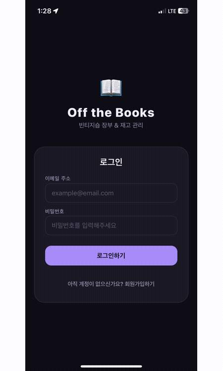

#### 로그인 / 회원가입
<table>
<tr>
<td>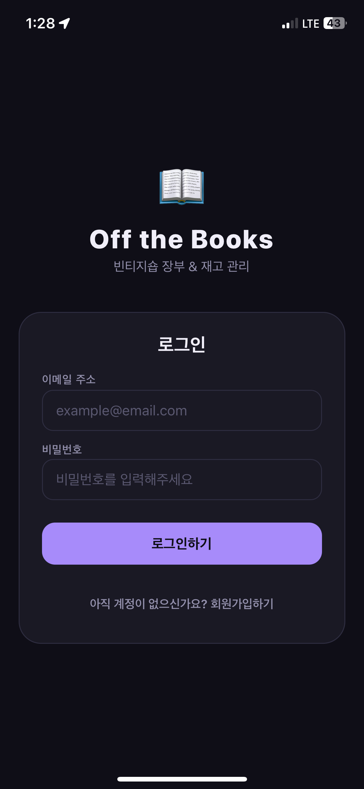</td>
<td>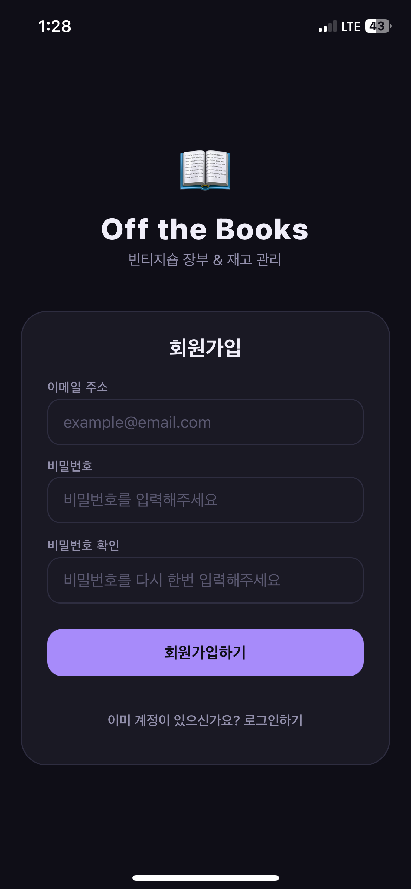</td>
</tr>
</table>

#### 대시보드 (월별 매출·순이익 리포트)
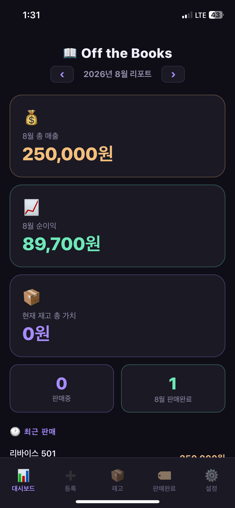

#### 상품 등록
<table>
<tr>
<td>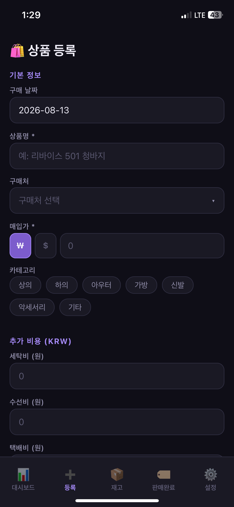</td>
<td>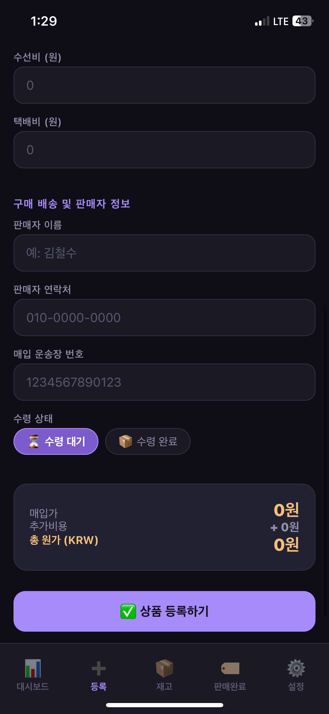</td>
</tr>
</table>

#### 재고 목록 (아코디언 상세 · 액션 버튼)
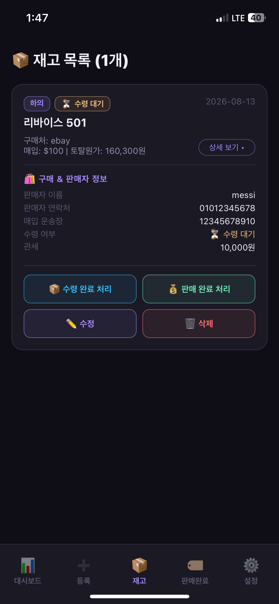

#### 판매 완료 처리
<table>
<tr>
<td>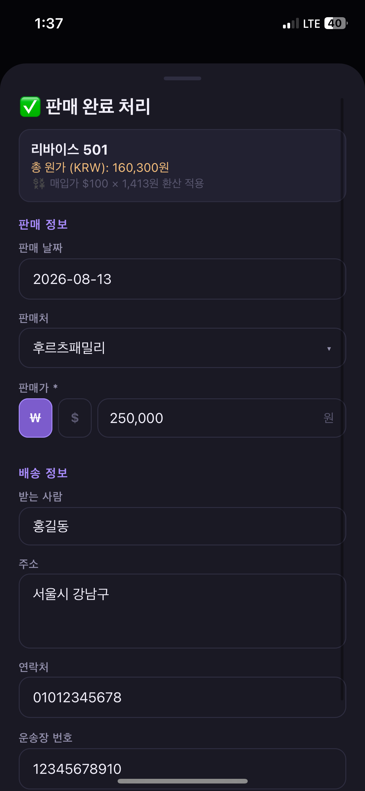</td>
<td>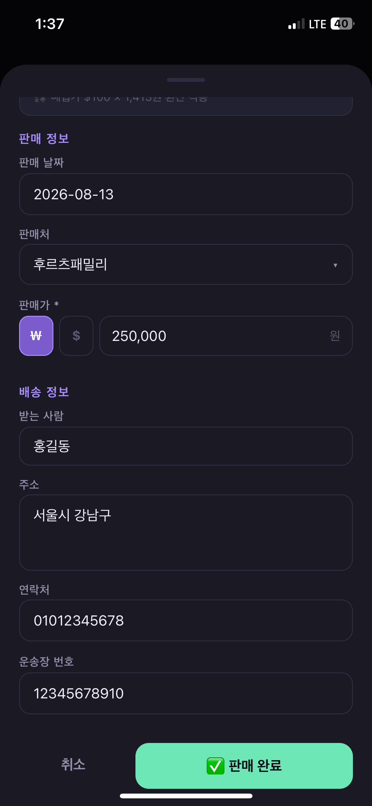</td>
</tr>
</table>

#### 판매 완료 목록 / 수익 분석
<table>
<tr>
<td>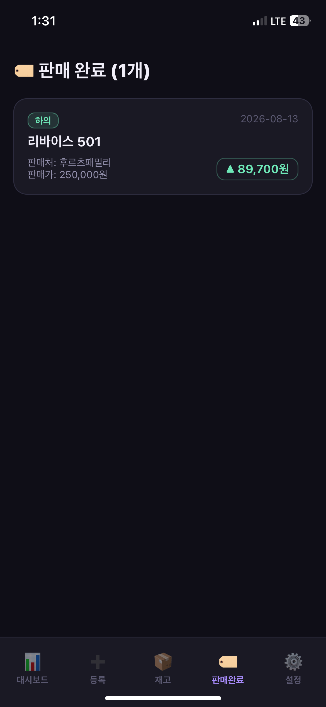</td>
<td>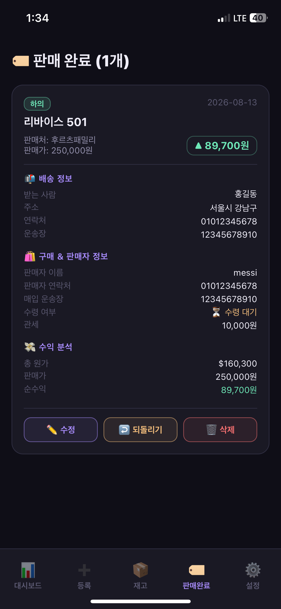</td>
</tr>
</table>

#### 설정 (실시간 환율)
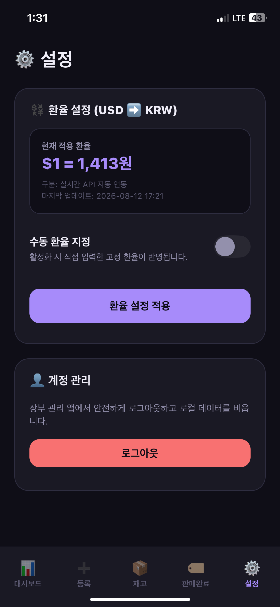

---

## 🔧 Development Process

- **커밋 컨벤션**: 초기에는 타임스탬프 기반 메시지로 커밋하다가, 프로젝트가 커지면서 `feat`, `fix`, `docs`, `refactor` 등 Conventional Commits 스타일로 전환해 변경 이력을 구조화했습니다.
- **테스트**: 인증 라우트에 대해 Jest + Supertest 기반 유닛 테스트를 작성했습니다.
- **개발 방식**: 1인 개발로 별도 브랜치 전략 없이 `master` 브랜치에 직접 커밋하는 방식으로 진행했습니다.

---

## 📬 Contact

- Email: [gks12090607@gmail.com](mailto:gks12090607@gmail.com)

---

## 📄 License

This project is licensed under the MIT License — see [LICENSE](./LICENSE) for details.
